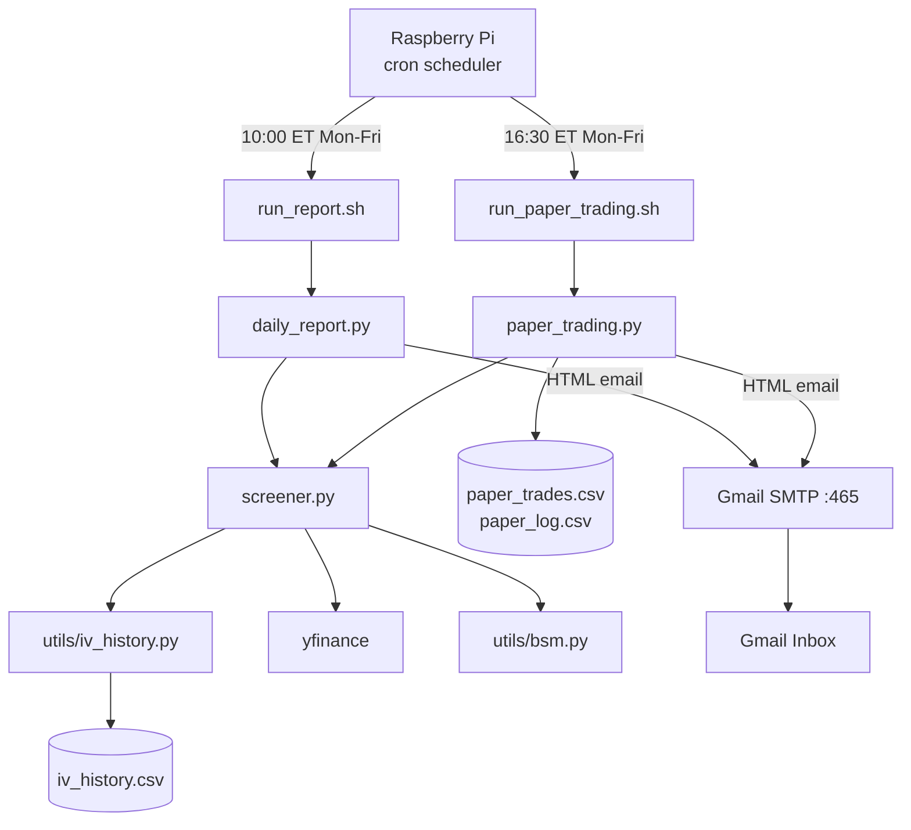
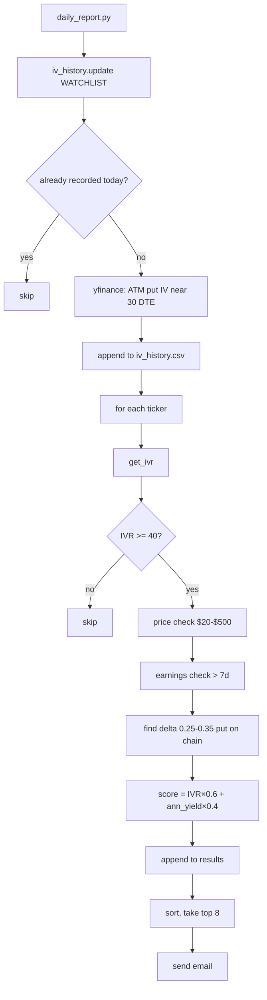
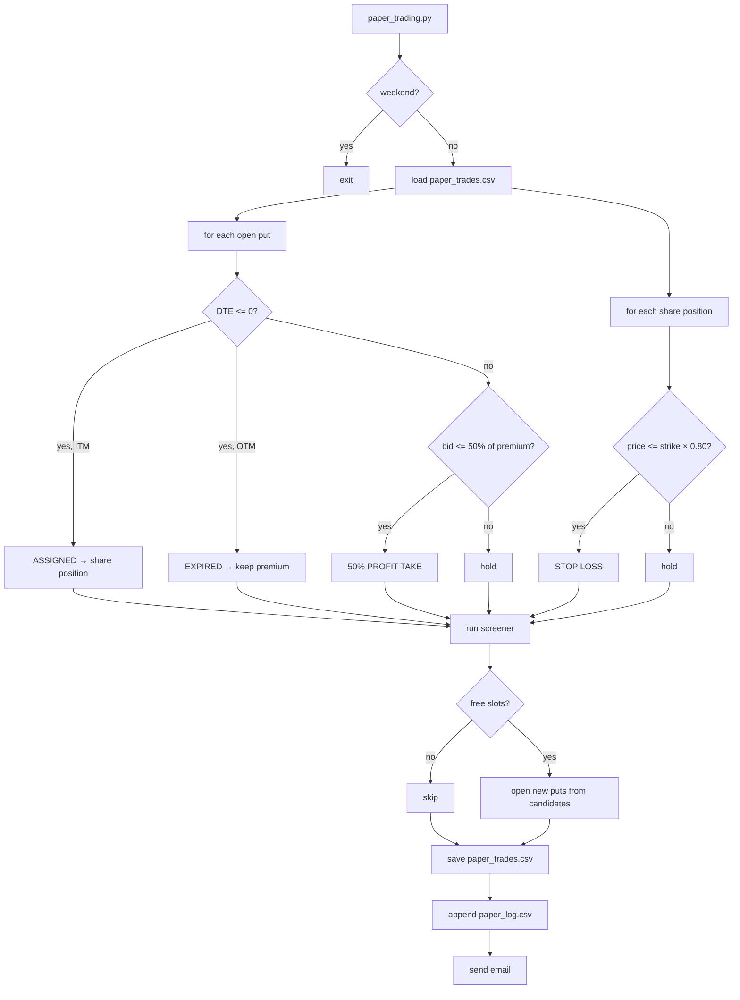

# Technical Design

## System architecture



---

## Morning screener flow



---

## Paper trading engine flow



---

## File structure

```
options-trader/
├── config.py                   # all parameters — single source of truth
├── screener.py                 # → List[Dict] ranked candidates
├── daily_report.py             # morning email
├── paper_trading.py            # end-of-day engine + evening email
├── utils/
│   ├── bsm.py                  # price(), delta(), strike_for_delta()
│   ├── data_fetcher.py         # get_prices(), historical_volatility()
│   └── iv_history.py           # update(), get_ivr(), bootstrap_from_orats()
├── data/                       # runtime data, not in git
│   ├── iv_history.csv
│   ├── paper_trades.csv
│   └── paper_log.csv
├── run_report.sh
├── run_paper_trading.sh
└── setup_pi.sh
```

---

## Configuration reference

All tuneable parameters in `config.py`:

| Parameter | Value |
|-----------|-------|
| `DELTA_LOW / HIGH` | 0.25 / 0.35 |
| `DTE_MIN / MAX` | 21 / 45 |
| `MIN_IVR` | 40 |
| `MAX_POSITIONS` | 5 |
| `POSITION_SIZE_PCT` | 20% |
| `STOP_LOSS_PCT` | 20% |
| `PROFIT_TAKE_PCT` | 50% |
| `MIN_OPTIONS_OI` | 500 |
| `MAX_SPREAD_PCT` | 20% |
| `EARNINGS_BUFFER_DAYS` | 7 |
| `COMMISSION_PER_CONTRACT` | $0.65 |
| `RISK_FREE_RATE` | 4.5% |
