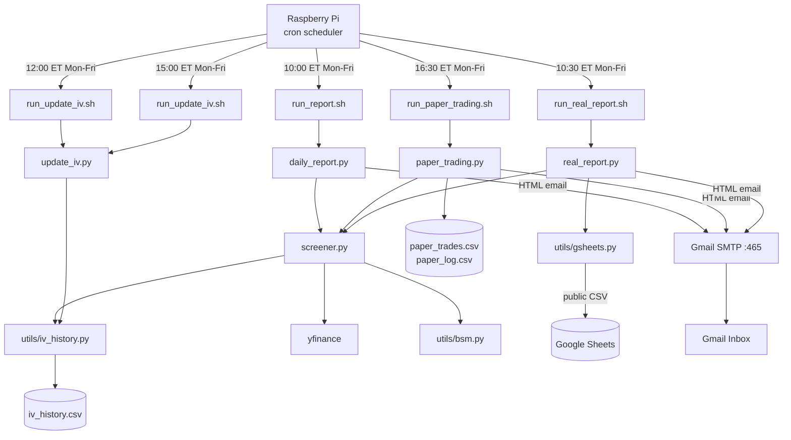
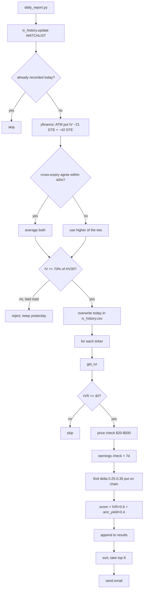
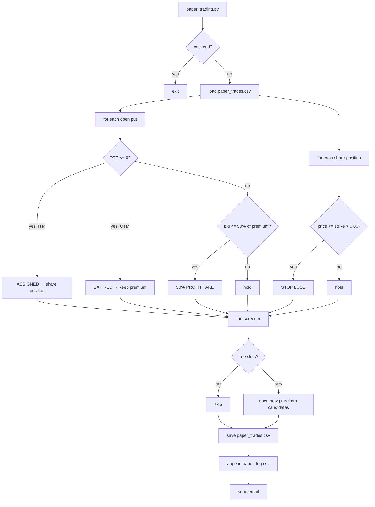

# Technical Design

## System architecture



---

## Morning screener flow



---

## Paper trading engine flow



---

## Real report flow (`real_report.py`)

Runs at 10:30 AM ET and emails a real-portfolio snapshot sourced from Google Sheets:

1. Read all traders from the `Traders` config tab (`utils/gsheets.py`)
2. For each trader, load their trade tab (open puts, calls, shares)
3. **Screener** — run IVR scan to find new candidates
4. **Open positions** — for each open put/call: fetch current ask price via yfinance (fuzzy ±3-day expiry match), show unrealised P&L, close cost, `% of premium remaining`
5. **Roll opportunities** — scan yfinance for a 21–45 DTE expiry and nearest strike; compute net credit `(new bid - current ask) × 100 × contracts`; only show rolls that produce a net credit ≥ $0
6. **ITM alert** — if a put is in-the-money and DTE ≤ 7, generate an assignment prep message ("plan a covered call at $X after assignment")
7. **Shares** — current price vs cost basis, unrealised P&L (no ×100 multiplier)
8. **Sheet hotlink** — email includes a button linking directly to the Google Sheet
9. Email to trader's address

Key behaviours:
- Column shows **Close Ask** (cost to buy back the short) not bid
- `$0.00` bid shown as `~100% ✓ TAKE` (option is essentially worthless)
- Roll analysis runs independently for every open put regardless of screener results
- **Held Shares Net P&L** = price change + closed put P&L + closed CC P&L + unrealized open CC credit — the full wheel-cycle P&L, not just the stock price move
- **CC P&L** column shows total covered-call income (closed calls P&L + unrealized credit from open calls still running)

---

## File structure

```
options-trader/
├── config.py                   # all parameters + GOOGLE_SHEET_ID
├── screener.py                 # → List[Dict] ranked candidates
├── daily_report.py             # paper morning email
├── real_report.py              # real portfolio email (Google Sheets source)
├── paper_trading.py            # end-of-day engine + evening email
├── update_iv.py                # standalone IV refresh — run multiple times/day
├── utils/
│   ├── bsm.py                  # price(), delta(), strike_for_delta()
│   ├── data_fetcher.py         # get_prices(), historical_volatility()
│   ├── gsheets.py              # get_traders(), get_trades(), compute_metrics()
│   └── iv_history.py           # update(), get_ivr(), bootstrap_from_orats()
├── data/                       # runtime data, not in git
│   ├── iv_history.csv
│   ├── paper_trades.csv
│   └── paper_log.csv
├── run_report.sh               # paper screener cron wrapper
├── run_real_report.sh          # real report cron wrapper
├── run_paper_trading.sh        # paper engine cron wrapper
├── run_update_iv.sh            # IV refresh cron wrapper
└── setup_pi.sh
```

---

## Configuration reference

All tuneable parameters in `config.py`:

| Parameter | Value |
|-----------|-------|
| `DELTA_LOW / HIGH` | 0.25 / 0.35 |
| `DTE_MIN / MAX` | 21 / 45 |
| `MIN_IVR` | 40 |
| `MAX_POSITIONS` | 5 |
| `POSITION_SIZE_PCT` | 20% |
| `STOP_LOSS_PCT` | 20% |
| `PROFIT_TAKE_PCT` | 50% |
| `MIN_OPTIONS_OI` | 500 |
| `MAX_SPREAD_PCT` | 20% |
| `EARNINGS_BUFFER_DAYS` | 7 |
| `COMMISSION_PER_CONTRACT` | $0.65 |
| `RISK_FREE_RATE` | 4.5% |
